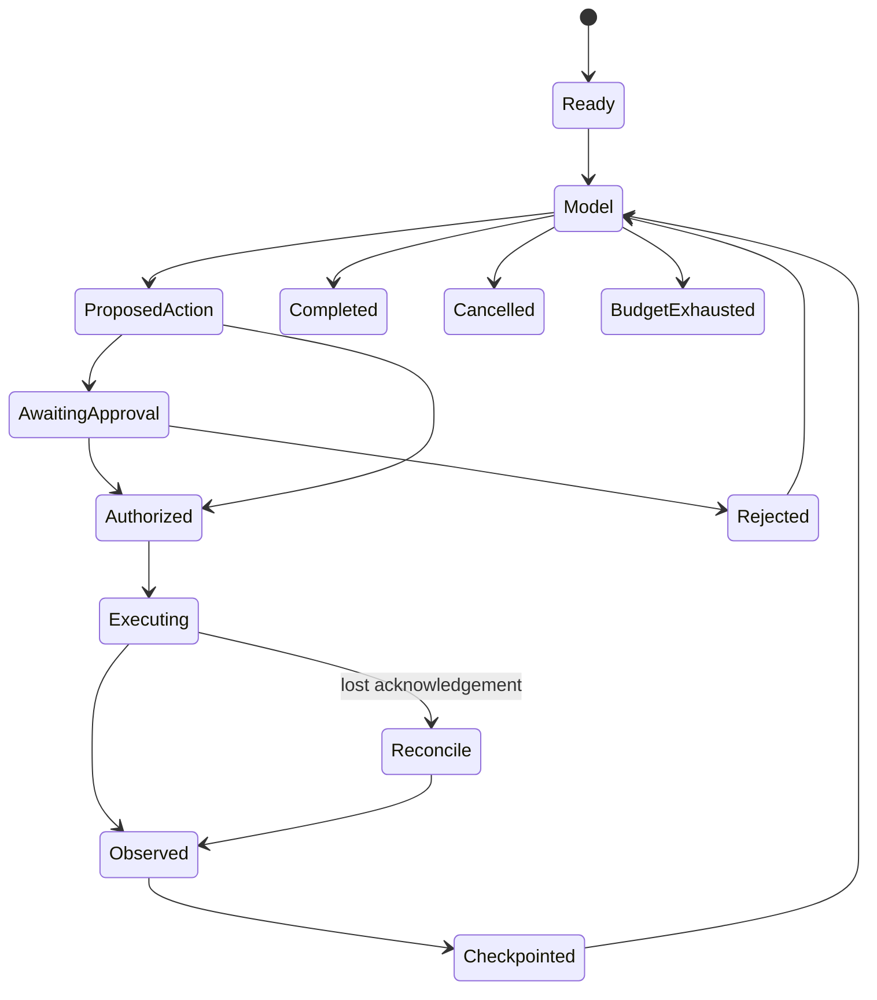

# A design dossier for an independent harness

This is a set of proposed contracts and acceptance experiments, not a selected
production architecture. The implementation belongs in a separate repository.
Any developer can implement alternatives and use the same experiments.

## Component contracts and state

A model port accepts a bounded context, tool schemas and request settings, and
returns text or correlated action requests plus usage/error metadata. A context
builder chooses evidence without owning authorization. A scheduler owns task and
attempt budgets. A policy port decides whether an exact operation is allowed.
An executor applies allowed operations inside a chosen runtime. A state store
owns checkpoints; effect sinks own idempotency/reconciliation. An evaluator reads
independent observations.

Use the [neutral architecture](../concepts/architecture.md) as a responsibility
map, not a requirement to create one class or service per box. Tools, memory,
model providers, execution providers and exporters are extension boundaries.
Keep their versioned contracts independent of one framework's message classes.

A candidate lifecycle is:

Cancellation while an effect is in flight requires reconciliation; a cancelled
task is not proof that its external effect was cancelled. Persist task identity,
operation identity, scope, policy revision, checkpoint version and observation
references. Do not persist credentials inside state.

## Requirements traced to evidence

| Requirement | Problem and evidence | Alternatives | Acceptance experiment |
|---|---|---|---|
| R1: bound calls/actions and correlate replies | [Tool errors](../problems/tool-errors.md), [loop lesson](loop.md) | State machine or framework-native loop | Duplicate IDs, malformed arguments and exhaustion tests in test_learning_loop |
| R2: retain required evidence within budget | [Context growth](../problems/context-growth.md), [context lesson](context.md) | Full history, window, retrieval or explicit compaction | Early required fact survives; too-small budget fails visibly |
| R3: scope durable memory by trusted identity | [Context growth](../problems/context-growth.md), memory fixture | Per-tenant store or scoped queries | Cross-tenant/session retrieval returns nothing; fresh-process read succeeds |
| R4: separate tool protocol from authorization | [Approval](../problems/approval.md), [MCP recipe](protocols.md) | Direct functions, MCP gateway or remote service | Discovery/success/invalid/error round trip; test authority separately |
| R5: bind approval to exact operation | [Approval](../problems/approval.md), boundary approval pair | Preapproved capability or explicit human decision | Zero effects after rejection; permitted control still completes |
| R6: preserve effect identity across restart | [Restart](../problems/restart.md), [reliability lesson](reliability.md) | Sink idempotency, outbox or reconciliation | Kill after commit before checkpoint; independent sink counts one effect |
| R7: enforce nested budgets and cancellation | [Retry amplification](../problems/retry-amplification.md), reliability fixture | Cooperative tasks or supervised workers | Attempt timeout, whole-task deadline, cancellation cleanup |
| R8: verify evidence independently | [Retry amplification](../problems/retry-amplification.md), [workbench](evaluation.md) | Local journal plus sink, or external collector | Removed event and invented effect must fail audit |
| R9: preserve useful work under restrictions | [Tool errors](../problems/tool-errors.md), [boundary arena](../arenas/boundary_response.md) | Per-call policy or batch preflight | Mixed denied/allowed batch and fallback retain allowed effects |
| R10: choose execution containment explicitly | [Approval](../problems/approval.md), [runtime recipe](security-operations.md) | Process, container, VM or remote service | Verify effective limits/owned writes/cleanup; report unsupported hosts |
| R11: charge delegation transparently | [Delegation cost](../problems/delegation-cost.md), existing multi-agent experiments | Direct loop, handoff or sub-agent | Equal task/tools/context and independently checked usage; provenance across delegation is a future spike |
| R12: separate durable facts from live signals | [DeepSeek Harness source review](../harnesses/deepseek-harness.md) | Event journal plus ephemeral control bus, or one typed stream with retention rules | Rebuild model-visible history from committed facts after a crash; transient status may disappear |
| R13: reconcile unknown tool outcomes | [Restart](../problems/restart.md), [DeepSeek Harness source review](../harnesses/deepseek-harness.md) | Stable operation ID plus sink lookup, outbox, or explicit human resolution | Kill after invocation and before settlement; never repeat an effect without reconciliation |
| R14: make extensions part of authority | [DeepSeek Harness source review](../harnesses/deepseek-harness.md) | Signed allowlist, isolated extensions, or reviewed in-process plugins | Record extension source/version/capabilities; reject an unapproved extension before code loads |

The executable tests live under [tests](../../tests/); none of these requirements
depends on a provider-specific reasoning capability. The current fixtures test
mechanics. Real-model task quality needs separately labelled, repeated trials.

## Open decisions and bounded spikes

| Decision | Small experiment before committing |
|---|---|
| SQLite versus remote checkpoint store | Two workers contend on one synthetic task; reject stale lease completion |
| Idempotency retention and reconciliation | Expire a deduplication key, replay a lost acknowledgement, define the ambiguity policy |
| Context compression policy | Compare full history and compression on fixed evidence questions, measuring retention and cost separately |
| Delegation ownership | Cancel a parent during a child effect; identify who reconciles and accounts usage |
| Uncooperative tool cancellation | Terminate an owned worker that ignores cancellation; check orphan cleanup |
| Protocol authentication | Bind caller identity to a tool permission and test revocation; MCP transport success alone is insufficient |
| Trace export | Round-trip redacted events through a local collector with deliberate loss; fail completeness |
| Runtime choice | Run identical owned fixtures under two configurations; record exclusions rather than infer escape resistance |
| Automation protocol | Correlate concurrent prompts with terminal results, usage, cancellation, and unknown-outcome recovery |

## Design references from complete harnesses

The [coding harness comparison](../harnesses/comparison.md) supplies design
references rather than a shopping list. DeepSeek Harness informs durable event
semantics; OpenHands informs SDK/runtime/client separation; OpenCode informs
causal session APIs and ordered policy; Cline informs workspace checkpoints;
goose informs protocol-first extensions and portable workflows; SWE-agent
informs reproducible trajectories; Aider informs bounded repository context,
edit protocols, and Git-native recovery. A new harness should adopt a behavior
only when its own problem record and acceptance experiment justify the cost.

These are proposals and gaps, not claims that the teaching examples implement
distributed leases, production identity, or full mediation.

## Bootstrap and fair evaluation

1. In a separately created repository, let its owner choose name, license and
   supported environments. Write threat model, ownership and compatibility policy.
2. Implement the smallest model/tool/context loop and run R1–R3 offline.
3. Define operation/approval identity and restart semantics before adding remote
   effects. Run R4–R8 and deliberately broken variants.
4. Choose execution providers and run R9–R10 with recorded effective settings.
5. Add delegation only when R11's cost, cancellation and ownership questions are
   answered. Run native-model evaluations as a distinct evidence class.

To join Arena, implement [Framework/AgentRunner](../../arena/types.py), return
honest usage, declare unsupported capabilities, and expose enough independent
observations for relevant arenas. Boundary coverage requires a reviewed integration;
adding an adapter name to a supported list alone is insufficient.

Use the same dataset, model mode, tool schemas, budgets, scorer and exclusions as
competing designs. Do not give the maintainer's harness a private prompt, special
scoring rules or unreported retries. Keep unavailable, unassessed, harness errors
and observed failures distinct.

For every implementation discovery: reproduce it with a minimal fixture, add or
update a neutral [problem record](../problems/index.md), link evidence and rejected
alternatives, then revise this dossier and the [knowledge vault](../../knowledge/README.md).
A result should improve the ecosystem guide even when it argues against our own
implementation choice.
