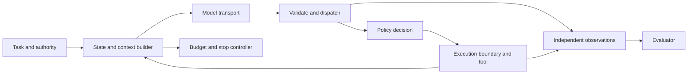

# Agent and harness architecture

An agent uses model output to decide what to do next. A harness makes those
decisions executable: it owns the conversation, tools, authority, budgets,
state transitions, observations, and the conditions under which work ends.
You can implement these responsibilities yourself or assemble libraries.

## Vocabulary and ownership

| Concept | Responsibility | What it does not establish |
|---|---|---|
| Model transport | Serialize requests and responses; account for usage | Authority to execute a suggested action |
| Agent loop | Advance a task from observation to next decision | Unbounded retries or unlimited time |
| Harness | Coordinate the loop, tools, state, execution and observation | A particular framework or provider |
| Framework | Supply reusable orchestration abstractions | Correct application policy by default |
| Tool | Expose a typed operation and result contract | An OS sandbox for arbitrary code |
| State | Record progress and decisions needed to continue | Everything that must fit into model context |
| Context | Information actually supplied to one model request | Durable storage or truth |
| Memory | Information deliberately retained/retrieved across steps or sessions | Permission to mix users' data |
| Execution boundary | Restrict access to resources outside the loop | Correctness of the model's reasoning |
| Policy | Decide whether an actor may perform an action | Proof that every execution path is mediated |
| Evaluator | Compare observations with an independent expected outcome | Ground truth derived from the implementation being graded |



The evaluator needs both reported intent and actual effects. A tool-call log can
say “executed” even when an SDK dropped the result, and a final answer can claim
success without an effect. Observe the fixture or external system independently.

## The minimal transition system

```text
receive task → build context → request model response
  final answer → validate output → completed or invalid
  tool request → validate arguments → authorize → execute → append result → repeat
  approval needed → persist request → suspended → decision → resume
  error/timeout/cancel/budget exhausted → explicit terminal or retryable outcome
```

Terminal states must be distinct. An exhausted loop is not successful completion.
Every accepted tool call needs an attributable result, including a denied or failed
result. In a batch, choose whether siblings continue; document the choice and test
it. Tool-call IDs correlate a model request with its response; an operation ID can
additionally identify a side effect across retries.

## Implement the smallest design

```python
for step in range(max_steps):
    check_cancel_and_deadline()
    response = model.complete(build_context(state), tool_schemas)
    if response.is_final:
        return validate_final(response)
    for call in response.calls:
        outcome = dispatch_validated_authorized_call(call)
        state.append(call, outcome)
return exhausted_result(state)
```

This pseudocode leaves decisions visible: a transport timeout bounds an attempt,
not a whole task; cancellation of a coroutine does not necessarily stop a remote
operation; a retry after a timeout may duplicate an effect. These are contracts to
implement and verify rather than details a larger framework automatically solves.

## Design alternatives and failure tests

| Decision | Alternatives and tradeoff | Test that changes the decision |
|---|---|---|
| Loop control | Explicit loop is inspectable; graph supports explicit branching; event runtime supports concurrent work | Reproduce a mixed batch and check result ordering/loss |
| State | Transcript replay is portable but grows; checkpoints can store richer state but require compatible serialization | Restart in another interpreter and compare actual effects |
| Context | Full history retains evidence but grows; windows/summaries save space but can discard obligations | Put a required fact early, then verify retention and provenance |
| Tool errors | Raise to supervisor or deliver structured error to model | Ensure repeated identical invalid calls terminate within budget |
| Approval | Pause before execution or merely emit an advisory signal | Ignore the signal deliberately and observe whether effects occur |
| Delegation | Shared conversation, isolated worker, remote task | Trace authority, context copying, cost and failure ownership |
| Observation | SDK traces, gateway capture, independent service ledger | Drop an event and verify the oracle detects missing evidence |

## Scope and implementation examples

The [vanilla adapter](../../frameworks/vanilla/adapter.py) demonstrates a bounded
loop and serialized transcript resume. It is not a full production harness.
[Framework adapters](../frameworks/README.md) illustrate other implementations.
The repository's [batch findings](../findings.md), [durability](../arenas/durable_state.md),
and [delegation measurements](../multi-agent.md) provide scoped local evidence;
they do not prove one architecture is universally best.

This guide is a design synthesis based on the inspected local adapter contract
and tests, reviewed 2026-09-18. Current implementation sources are
[types](../../arena/types.py), [runner](../../arena/runner.py),
[tools](../../arena/tools/__init__.py), and [fairness controls](../fairness-controls.md).
For external implementations and their review depth use the
[source catalog](../../knowledge/maps/repositories.md).

Continue with [the build path](../build/README.md) or [all journeys](../index.md).
