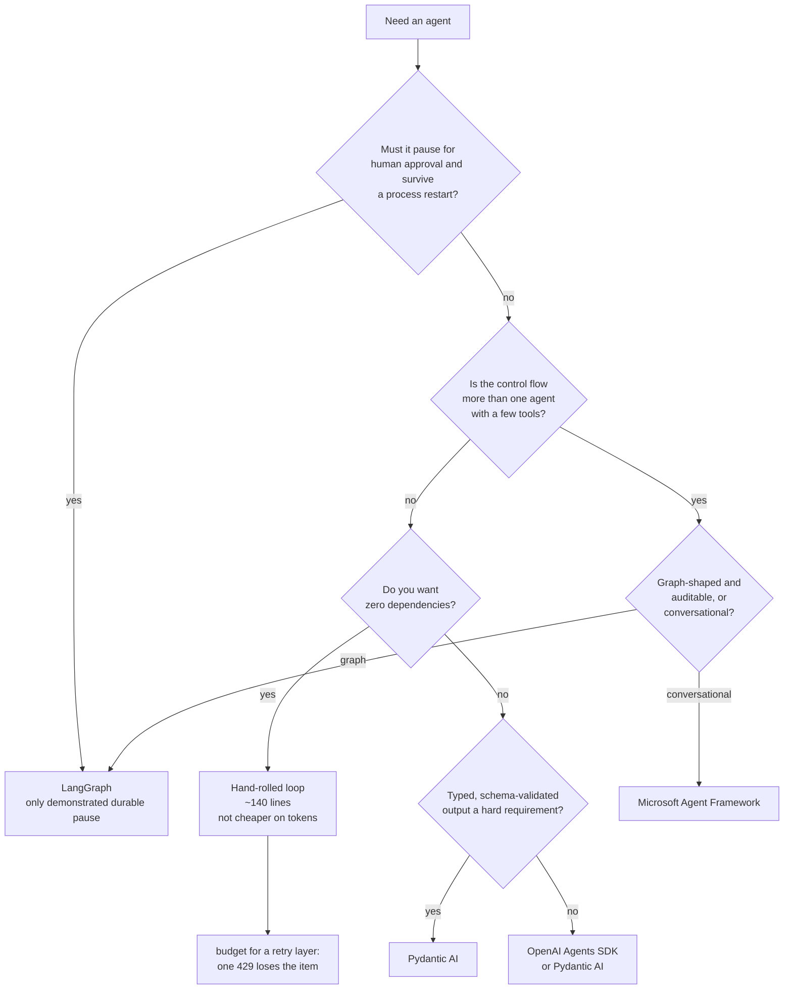

# Choosing a framework

> **What this guide can and cannot tell you.** There is no live scorecard yet — no
> API key has been wired into the `full-run` workflow — so **nothing here is about
> answer quality**. Every measured claim below comes from offline runs where the
> model is held byte-identical and only the framework varies, which makes them
> claims about *mechanics, cost and robustness*. Those are real, reproducible, and
> often the things that actually bite. They are not a quality ranking.
>
> Claims are tagged **[measured]** or **[claimed]**. A `[claimed]` row comes from
> upstream documentation and nobody has verified it here.

## 1. Do you actually need a framework?

The intuition is that a hand-rolled loop must be the cheapest thing on the wire.
This guide first wrote that down as a hypothesis, then published the opposite
after measuring, and has now had to take that back: the frameworks that measured
cheaper were **sending less**. See [tool-schemas.md](tool-schemas.md).

Same task, same tools — genuinely the same tools now — same scripted turns; the
only variable is how each library serialises the request. **[measured]**

| framework | prompt tokens / item | vs baseline |
|---|--:|--:|
| `vanilla` (hand-rolled, stdlib) | 753.5 | 1.00× |
| `langgraph` | 753.5 | 1.00× |
| `pydantic_ai` | 794.0 | 1.05× |
| `microsoft_af` | 802.0 | 1.06× |
| `google_adk` | 836.1 | 1.11× |
| `openai_agents` | 856.9 | 1.14× |
| `smolagents` | 2935.5 | **3.90×** |

**No framework is leaner on the wire than the by-hand loop**, and `langgraph`
ties it byte for byte. Six sit inside a 1.15× band, and what separates the others
from the floor is decoration — `title` on every property,
`additionalProperties: false`, `strict: true` — rather than tighter
serialisation. That is a duller claim than the one it replaces and it is the one
the measurement supports.

`smolagents` is the outlier, and for a different reason: not tool serialisation
but a 4.2 KB templated system prompt it prepends to yours and resends on every
request — including a prose restatement of the tools it has *already* sent as a
schema. That scaffolding is what lets it drive models that tool-call badly; if
yours tool-calls well, it is ~3.8 KB per request you are paying for nothing. See
[overhead.md](overhead.md).

### That 3.90× is a *short-item* number

The table above is a two-call task, which is where a fixed per-request cost looks
its worst. Running the same conversation out to 30 tool-calling turns, the
`smolagents` multiple decays from **8.83× on request 1 to 1.27× on request 31**.
**[measured]**

The reason is a general one: every framework here grows at the same rate
(136.7–148.2 tokens per turn, an 8% band) and differs only in a constant. A
constant paid once per request is linear in turns; the conversation it is divided
by is quadratic. So any framework overhead decays as `1/n`.

Read it that way: the multiple bites on short, high-volume items —
classification, extraction, one-shot RAG — and washes out on long agentic loops.

**And nobody truncates.** Not one of the seven drops, windows or summarises
history; all 31 requests carry the whole conversation. If you are running long
loops on a real bill, context management is something you build, not something
any of these libraries does for you by default. See
[overhead.md](overhead.md#what-happens-when-the-loop-gets-long).

### The one place the hand-rolled loop simply loses

Everything above says the framework tax is small or negative. This does not:
**[measured]**

| | one 429 | three consecutive 429s |
|---|---|---|
| `vanilla` (hand-rolled) | **loses the item** | loses the item |
| every framework here | survives (2–3 attempts) | raises, except `smolagents` |

The hand-rolled loop has **no retry at all**, so a single transient rate limit
loses the item. Every framework survives one without you writing a line. It is
the only dimension measured in this repo where the baseline is beaten outright —
and no arena could see it, because arenas script the *model* misbehaving, not the
provider.

Two footnotes that matter operationally. `langgraph` retries **once** where the
others retry twice, which against a provider that rate-limits in bursts is the
difference between a blip and a lost item. And `smolagents` is the only one that
survives three consecutive 429s — by **sleeping two to four minutes** on a single
item, which no scorecard can show you because the item *passes*. See
[transport.md](transport.md).

### So

"Avoid the framework tax" is not a good reason to hand-roll: on short items the
tax is roughly zero for six of seven, on long ones it decays away, and on a
flaky gateway hand-rolling costs you items. The real reasons to hand-roll are
that you want zero dependencies, you want to read every line of the loop, or your
control flow is genuinely trivial — and if you do, budget for the retry layer you
are now writing yourself. The `vanilla` adapter is 142 lines *before* that.

Conversely, the reasons to adopt one are orchestration, durability, interrupts,
retry-on-the-wire, and a large tool surface you don't want to hand-manage — not
token efficiency.

## 2. What breaks under stress?

The `resilience` arena scripts eight faults — malformed tool arguments, a tool
that doesn't exist, a required argument omitted — byte-identical for every
framework. Any difference is the framework's own error handling. **[measured]**

| framework | recovered | fails on |
|---|--:|---|
| `vanilla` | 8/8 | — |
| `pydantic_ai` | 8/8 | — |
| `microsoft_af` | 8/8 | — |
| `langgraph` | **7/8** | `res-01` — gives up when the model returns malformed tool arguments |
| `openai_agents` | **7/8** | `res-02` — raises `ModelBehaviorError` on an unknown tool name |
| `google_adk` | **6/8** | `res-01` and `res-02` — the only framework that loses both, by raising |
| `smolagents` | **4/8** | every fault its validator rejects *before* running the tool |

The LangGraph and OpenAI Agents failures are not fatal in production — both are
recoverable with a retry wrapper — but they are the kind of thing you find out
about at 3am rather than in a benchmark, which is the point of scripting them.

`smolagents` is a structural difference rather than a single rough edge. It
recovers from all four faults where the tool *ran* and returned something, and
loses all four the tool-validation layer rejects first (unknown name, missing
argument, unexpected argument, `null` arguments) — because it never writes those
back into the conversation. The model cannot see the error, so it re-emits the
identical call until the step budget is gone. Retry wrappers do not help; the
prompt is byte-identical each time.

## 3. Do you need to pause for a human?

The `human_in_the_loop` arena observes the pause *in the harness* rather than
trusting the agent's prose, so an agent that says "I'd need approval for this"
and books the room anyway fails. **[measured]**

| framework | pauses | survives a crash | mechanism |
|---|---|---|---|
| `langgraph` | ✅ 12/12 | ✅ 8/8 | `interrupt()` + an on-disk `SqliteSaver`; the graph itself is checkpointed |
| `openai_agents` | ✅ 12/12 | ✅ 8/8 | `needs_approval=True` on the tool; `RunState.to_json()`/`from_json()` serialise the whole run |
| `pydantic_ai` | ✅ 12/12 | 🟡 8/8 | tool raises `CallDeferred`; durability is stateless — the conversation is serialised and replayed as `message_history` |
| `vanilla` | 🟡 12/12 | 🟡 8/8 | stateless resume — the whole transcript is serialised into the resume state |
| `microsoft_af` | ✅ 12/12 | ❌ | `@tool(approval_mode="always_require")` + `ToolApprovalMiddleware`; the pause is held by the live `AgentSession`, whose message store does not survive JSON **[measured]** |
| `google_adk` | 🟡 12/12 | ✅ 8/8 | `LongRunningFunctionTool` **reports** the pause but does not enforce it — left alone the agent carries on and acts; `DatabaseSessionService` makes it survive a crash **[measured]** |
| `smolagents` | ❌ | ❌ | no interrupt or approval primitive to adapt **[measured]** |

The `durable_state` arena is the stricter test: the harness throws the runner
away at the pause and rebuilds it, so only a real checkpoint or a serialised
transcript gets across. Both pass — serialising the transcript yourself is a
legitimate way to be durable — but only LangGraph does it with a checkpointer,
which is what you want once the state stops fitting in a message list.

Six adapters now clear this bar and **no two use the same mechanism**, which is
the useful part:

- **LangGraph** checkpoints the graph itself to disk. Keeps working when state
  outgrows a message list.
- **OpenAI Agents SDK** serialises the whole run (`RunState`), not just the
  messages, and gives you `approve`/`reject` on the interruption directly.
- **Pydantic AI** hands you back the conversation and leaves persistence to you.
  Simplest; you own the storage decision.
- **Agent Framework** marks the tool `approval_mode="always_require"` and queues
  it in session state. The pause is real, but it is held by the live session — it
  is the one of the five that cannot survive the process dying.
- **Google ADK** reports a long-running call and expects *you* to stop; it is the
  only one of the six where ignoring the signal lets the agent act anyway.
- **`vanilla`** shows the floor: serialising your own transcript is ~40 lines.

All four produce an identical trace to the scorer, so pick on the mechanism, not
the score. `microsoft_af` reports *unsupported* rather than failing, which means
"nobody has wired it up", not "it can't". `smolagents` is the one case where it
does mean "it can't" — it ships nothing to adapt, so a pause there is something
you build on top rather than something you configure.

## 4. Gotchas worth knowing before you adopt

Each of these cost real debugging time while building the adapters. **[measured]**

| framework | gotcha |
|---|---|
| `pydantic_ai` | `Agent(retries=...)` is a **tool-validation** budget, not a loop cap. Capping the agent loop needs `UsageLimits(request_limit=...)`. Left alone, a 6-call budget ran **50** LLM calls. |
| `microsoft_af` | The tool loop is **uncapped** unless you set `max_iterations`. Same 6-call budget ran **41**. Async-only, so each item needs a fresh client and event loop. |
| `google_adk` | Needs `litellm` to reach anything but Gemini, which drags in boto3/tokenizers/huggingface-hub. Tool schemas come from the **docstring**, so a missing `Args:` block silently changes the schema. |
| `langgraph` | One tool round is *two* graph steps, so `recursion_limit` must be `2 × ` your LLM-call budget. `create_react_agent` is deprecated (moves to `langchain.agents` in 2.0). |
| `openai_agents` | Built-in tracing POSTs to `api.openai.com` unless explicitly disabled. |
| `smolagents` | `pip install smolagents` is not enough — `OpenAIServerModel` raises without the `[openai]` extra. `max_steps` is off by one (it makes one model call *beyond* the budget). An exhausted run returns `""`, not an exception, so a failure looks like a blank answer unless you read the last memory step. |
| `crewai` | Drives a **text ReAct loop**, not native OpenAI tool calling — it advertises no `tools` and stops on `Observation:`. Anything assuming function-calling semantics needs rework. Heavy transitive tree (chromadb → onnxruntime). |
| `claude_agent_sdk` | Drives the `claude` CLI over the Anthropic Messages API; it cannot sit behind one shared OpenAI-compatible gateway at all. |

Also: prefer the **narrow** package over the meta-package. `pydantic-ai-slim[openai]`
and `agent-framework-core` + `-openai` avoid dragging in azure/boto3/redis/qdrant/
ollama that none of this needs.

**And set a timeout, explicitly, in every one of them.** None of these libraries
takes a request timeout on the path you would naturally write, so a hung provider
sits on your worker for whatever the underlying client's default is — ten minutes,
for anything on the official OpenAI client. This repo shipped that bug in five of
seven adapters until it was measured. Each needs a different route: **[measured]**

| framework | how the timeout gets in |
|---|---|
| `openai_agents`, `microsoft_af` | `AsyncOpenAI(timeout=...)` |
| `pydantic_ai` | pass an `openai_client`; `OpenAIProvider(base_url=...)` builds its own and gives you no way in |
| `smolagents` | `OpenAIServerModel(client_kwargs={"timeout": ...})` |
| `google_adk` | `LiteLlm(timeout=...)` |
| `langgraph` | `ChatOpenAI(timeout=...)` |

Note also that the value bounds **one attempt**, not one item: a framework that
retries twice can spend three times it before giving up.

## 5. If you are splitting the work across agents

The *benefit* of delegation is still **[claimed]** — mock mode holds the model
constant, so it cannot tell you whether three roles answer better than one. The
**cost** is now measured across four delegation mechanisms in three libraries,
from one role to five, and it scales by an exact law. **[measured]**

| mechanism | library | LLM calls for N roles |
|---|---|---|
| `handoffs` — speaker swap | `openai_agents` | **N + 1** |
| `sub_agents` — transfer, returns to parent | `google_adk` | **N + 2** |
| `managed_agents` — sub-agent as a tool | `smolagents` | **2N** |
| `AgentTool` — sub-agent as a tool | `google_adk` | **2N** |

Three things to take from that table.

**"Handoff" is not one thing.** The OpenAI SDK and ADK both describe theirs as
transferring to another agent; ADK returns control to the *parent* afterwards and
the parent speaks again, which is the whole difference between N+1 and N+2. Same
word, different control flow.

**Sub-agent-as-a-tool costs double.** Two libraries that share no code agree at
every depth: the sub-agent's reply is a tool result rather than the end of the
run, so each level costs two calls instead of one.

**But calls are the wrong thing to optimise.** Prompt tokens for the same chains
at four roles, *inside ADK* so nothing else varies:

| mechanism | calls | prompt tokens |
|---|--:|--:|
| `sub_agents` — transfer | 6 | **7,375** |
| `AgentTool` — as a tool | 8 | **1,722** |

A transfer keeps one conversation every agent sees all of, so the prompt
compounds (15.4× from one role to four). A sub-agent-as-tool starts a *fresh*
conversation, so the prompt stays nearly flat and the calls compound instead.
Cheaper in calls is dearer in prompt, and prompt is usually the larger bill —
a reader who took only the call-count law from this table would pick the wrong
mechanism.

**Also**: offering a sub-agent costs prompt on every request whether or not
anyone delegates. See [multi-agent.md](multi-agent.md).

### Shape of the work

Still largely **[claimed]** — these map to arenas that exist but have no live
numbers.

| If the core need is... | Look first at... | Arena that tests it |
|---|---|---|
| Deterministic, auditable, resumable workflows | LangGraph — the only one that pauses via a real checkpointer | `human_in_the_loop` ✅, `durable_state` ✅ |
| Fastest path to a multi-agent prototype | CrewAI | `multi_agent` (structural pipelines measured; handoffs not yet) |
| Conversational multi-agent / event-driven | Microsoft Agent Framework | `multi_agent` |
| Minimal wrapper around one provider's models | OpenAI Agents SDK / Claude Agent SDK | `tool_use` |
| Type-safe outputs, model-agnostic | Pydantic AI | `structured_output` |
| Small local/open models that tool-call poorly | smolagents — its heavy prompt scaffolding is the point | `tool_use` |
| Long tool loops on a real bill | none of them — nobody truncates history by default | `tool_use` ✅ |

Constraints that override all of the above: language (Python vs TypeScript),
self-host vs SaaS, licence, provider lock-in, and existing infrastructure.

## 6. A decision sketch

If the answer to C is *yes*, the mechanism matters more than the library — see
§5. Roughly: a **speaker swap** (`handoffs`) is cheapest in calls and keeps one
compounding conversation; a **sub-agent-as-a-tool** (`AgentTool`,
`managed_agents`) costs twice the calls and keeps the prompt nearly flat. Pick on
which of those two bills you would rather pay, not on which library you already
have.

This sketch is deliberately about **mechanics**, not quality. Once a live
scorecard exists it should be revisited — a framework that is lean on the wire
and robust under faults can still produce worse answers, and nothing here would
have caught that.

## How to read the scorecards

- **Pass rate** first — but only from `--mode live`. Mock-mode pass rates are
  ~100% by construction and prove only that the adapter is wired correctly.
- **Mean tokens** — prompt covers messages *and* tool schemas, because both are
  billed. Multiply by your traffic.
- **Mean LLM calls** — orchestration overhead. Check the adapters are on the same
  iteration budget before comparing (see §4).
- **Errors** — the framework's own loop: recursion limits, tool-call parsing, retries.
- **Always check `--repeat`.** A 100% at repeat 1 is not a 100% at repeat 10; the
  scorecard reports per-repeat spread and lists items that flipped.

Run `python -m arena summary --print` for all of the measured tables above in one
view, regenerated from your own runs.
