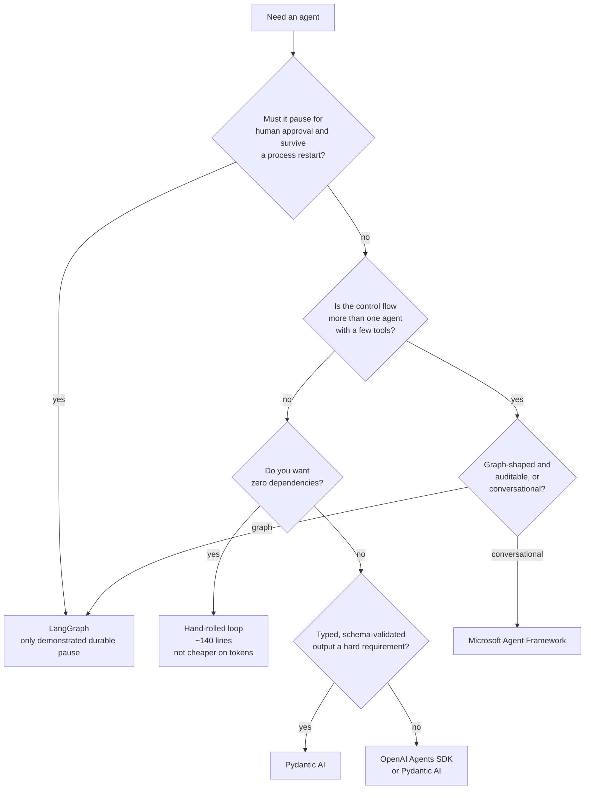

# Choosing a framework

> **What this guide can and cannot tell you.** There is no live scorecard yet — no
> API key has been wired into the `full-run` workflow — so **nothing here is about
> answer quality**. Every measured claim below comes from offline runs where the
> model is held byte-identical and only the framework varies, which makes them
> claims about *mechanics, cost and robustness*. Those are real, reproducible, and
> often the things that actually bite. They are not a quality ranking.
>
> Claims are tagged **[measured]** or **[claimed]**. A `[claimed]` row comes from
> upstream documentation and nobody has verified it here.

## 1. Do you actually need a framework?

The intuition is that a hand-rolled loop must be the cheapest thing on the wire.
**That turned out to be false here** — worth stating plainly, because it was
written in this guide as a hypothesis before it was measured.

Same task, same tools, same scripted turns; the only variable is how each library
serialises the request. **[measured]**

| framework | prompt tokens / item | vs baseline |
|---|--:|--:|
| `langgraph` | 683 | **0.90×** |
| `pydantic_ai` | 724 | 0.96× |
| `microsoft_af` | 732 | 0.97× |
| `vanilla` (hand-rolled, stdlib) | 754 | 1.00× |
| `openai_agents` | 787 | 1.04× |

Three of the four frameworks put *fewer* bytes on the wire than the by-hand loop,
because they render the same tool schemas more compactly. The spread across all
five is 1.15×. See [overhead.md](overhead.md).

So "avoid the framework tax" is not a good reason to hand-roll. The real reasons
to hand-roll are: you want zero dependencies, you want to read every line of the
loop, or your control flow is genuinely trivial. The `vanilla` adapter is 142
lines including the suspend/resume support.

Conversely, the reasons to adopt one are orchestration, durability, interrupts,
and a large tool surface you don't want to hand-manage — not token efficiency.

## 2. What breaks under stress?

The `resilience` arena scripts eight faults — malformed tool arguments, a tool
that doesn't exist, a required argument omitted — byte-identical for every
framework. Any difference is the framework's own error handling. **[measured]**

| framework | recovered | fails on |
|---|--:|---|
| `vanilla` | 8/8 | — |
| `pydantic_ai` | 8/8 | — |
| `microsoft_af` | 8/8 | — |
| `langgraph` | **7/8** | `res-01` — gives up when the model returns malformed tool arguments |
| `openai_agents` | **7/8** | `res-02` — raises `ModelBehaviorError` on an unknown tool name |

Neither failure is fatal in production — both are recoverable with a retry
wrapper — but both are the kind of thing you find out about at 3am rather than in
a benchmark, which is the point of scripting them.

## 3. Do you need to pause for a human?

The `human_in_the_loop` arena observes the pause *in the harness* rather than
trusting the agent's prose, so an agent that says "I'd need approval for this"
and books the room anyway fails. **[measured]**

| framework | pauses | survives a crash | mechanism |
|---|---|---|---|
| `langgraph` | ✅ 12/12 | ✅ 8/8 | `interrupt()` + an on-disk `SqliteSaver`; the graph itself is checkpointed |
| `openai_agents` | ✅ 12/12 | ✅ 8/8 | `needs_approval=True` on the tool; `RunState.to_json()`/`from_json()` serialise the whole run |
| `pydantic_ai` | ✅ 12/12 | 🟡 8/8 | tool raises `CallDeferred`; durability is stateless — the conversation is serialised and replayed as `message_history` |
| `vanilla` | 🟡 12/12 | 🟡 8/8 | stateless resume — the whole transcript is serialised into the resume state |
| `microsoft_af` | not wired | not wired | ships `ToolApprovalMiddleware`, but it needs an `AgentSession` and session state — a different shape again **[claimed]** |

The `durable_state` arena is the stricter test: the harness throws the runner
away at the pause and rebuilds it, so only a real checkpoint or a serialised
transcript gets across. Both pass — serialising the transcript yourself is a
legitimate way to be durable — but only LangGraph does it with a checkpointer,
which is what you want once the state stops fitting in a message list.

Four adapters now clear this bar and **no two use the same mechanism**, which is
the useful part:

- **LangGraph** checkpoints the graph itself to disk. Keeps working when state
  outgrows a message list.
- **OpenAI Agents SDK** serialises the whole run (`RunState`), not just the
  messages, and gives you `approve`/`reject` on the interruption directly.
- **Pydantic AI** hands you back the conversation and leaves persistence to you.
  Simplest; you own the storage decision.
- **`vanilla`** shows the floor: serialising your own transcript is ~40 lines.

All four produce an identical trace to the scorer, so pick on the mechanism, not
the score. `microsoft_af` reports *unsupported* rather than failing, which means
"nobody has wired it up", not "it can't".

## 4. Gotchas worth knowing before you adopt

Each of these cost real debugging time while building the adapters. **[measured]**

| framework | gotcha |
|---|---|
| `pydantic_ai` | `Agent(retries=...)` is a **tool-validation** budget, not a loop cap. Capping the agent loop needs `UsageLimits(request_limit=...)`. Left alone, a 6-call budget ran **50** LLM calls. |
| `microsoft_af` | The tool loop is **uncapped** unless you set `max_iterations`. Same 6-call budget ran **41**. Async-only, so each item needs a fresh client and event loop. |
| `langgraph` | One tool round is *two* graph steps, so `recursion_limit` must be `2 × ` your LLM-call budget. `create_react_agent` is deprecated (moves to `langchain.agents` in 2.0). |
| `openai_agents` | Built-in tracing POSTs to `api.openai.com` unless explicitly disabled. |
| `crewai` | Drives a **text ReAct loop**, not native OpenAI tool calling — it advertises no `tools` and stops on `Observation:`. Anything assuming function-calling semantics needs rework. Heavy transitive tree (chromadb → onnxruntime). |
| `claude_agent_sdk` | Drives the `claude` CLI over the Anthropic Messages API; it cannot sit behind one shared OpenAI-compatible gateway at all. |

Also: prefer the **narrow** package over the meta-package. `pydantic-ai-slim[openai]`
and `agent-framework-core` + `-openai` avoid dragging in azure/boto3/redis/qdrant/
ollama that none of this needs.

## 5. Shape of the work

Still largely **[claimed]** — these map to arenas that exist but have no live
numbers, and `multi_agent` currently runs single-agent role-play entries only.

| If the core need is... | Look first at... | Arena that tests it |
|---|---|---|
| Deterministic, auditable, resumable workflows | LangGraph — the only one with a demonstrated durable pause | `human_in_the_loop` ✅, `durable_state` ⬜ |
| Fastest path to a multi-agent prototype | CrewAI | `multi_agent` (no real multi-agent entries yet) |
| Conversational multi-agent / event-driven | Microsoft Agent Framework | `multi_agent` |
| Minimal wrapper around one provider's models | OpenAI Agents SDK / Claude Agent SDK | `tool_use` |
| Type-safe outputs, model-agnostic | Pydantic AI | `structured_output` |

Constraints that override all of the above: language (Python vs TypeScript),
self-host vs SaaS, licence, provider lock-in, and existing infrastructure.

## 6. A decision sketch

This sketch is deliberately about **mechanics**, not quality. Once a live
scorecard exists it should be revisited — a framework that is lean on the wire
and robust under faults can still produce worse answers, and nothing here would
have caught that.

## How to read the scorecards

- **Pass rate** first — but only from `--mode live`. Mock-mode pass rates are
  ~100% by construction and prove only that the adapter is wired correctly.
- **Mean tokens** — prompt covers messages *and* tool schemas, because both are
  billed. Multiply by your traffic.
- **Mean LLM calls** — orchestration overhead. Check the adapters are on the same
  iteration budget before comparing (see §4).
- **Errors** — the framework's own loop: recursion limits, tool-call parsing, retries.
- **Always check `--repeat`.** A 100% at repeat 1 is not a 100% at repeat 10; the
  scorecard reports per-repeat spread and lists items that flipped.

Run `python -m arena summary --print` for all of the measured tables above in one
view, regenerated from your own runs.
